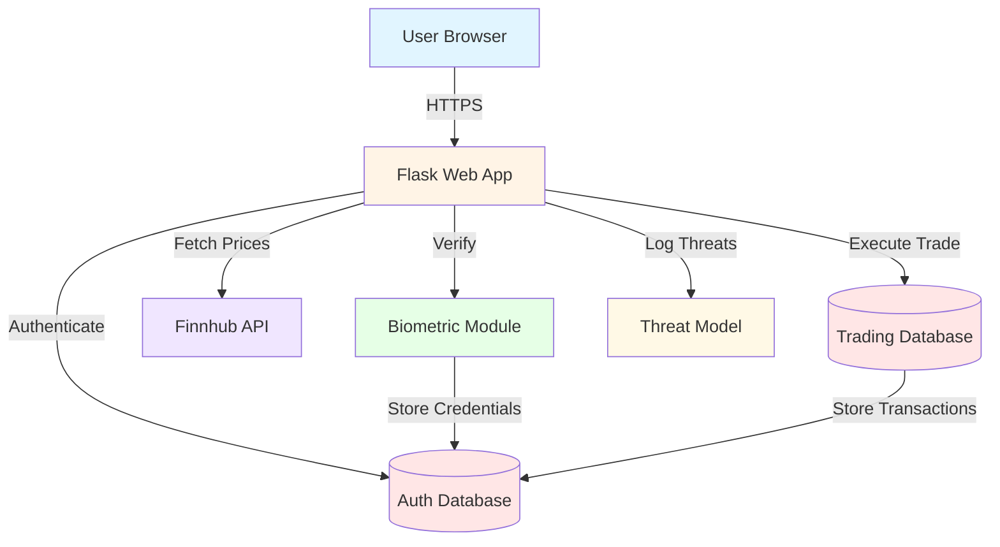

# Threat Model (STRIDE)

## Overview
This document outlines the security threats identified in the IS Lab project using Microsoft's STRIDE threat modeling framework.

## STRIDE Categories

| Category | Description |
|----------|-------------|
| **S**poofing | Impersonating another user or system |
| **T**ampering | Unauthorized modification of data |
| **R**epudiation | Denying that an action occurred |
| **I**nformation Disclosure | Exposing sensitive information |
| **D**enial of Service | Making services unavailable |
| **E**levation of Privilege | Gaining unauthorized access |

## Components & Threats

### 1. Biometric Verification Module

| STRIDE Category | Threat | Severity | Mitigation |
|----------------|--------|----------|------------|
| Spoofing | Fake WebAuthn credentials or cloned keys | High | Server-side signature validation via WebAuthn library, challenge-response verification |
| Tampering | Manipulated biometric assertions | High | Cryptographic signature verification, nonce-based challenges |
| Repudiation | User denies performing biometric verification | Medium | Transaction logging with biometric verification timestamp |

### 2. Stock API Integration

| STRIDE Category | Threat | Severity | Mitigation |
|----------------|--------|----------|------------|
| Information Disclosure | API key exposure in frontend | High | Proxy all API calls through backend, store keys in environment variables |
| Denial of Service | API rate limiting exhaustion | Medium | Request throttling, response caching, error handling |
| Tampering | Manipulated stock price data | Medium | Server-side validation, direct API calls from backend only |

### 3. Dummy Trading System

| STRIDE Category | Threat | Severity | Mitigation |
|----------------|--------|----------|------------|
| Tampering | Manipulated trade requests without verification | High | Require verified biometric token before confirming trades, validate on server-side |
| Repudiation | User denies executing trades | Medium | Transaction logging with user_id, timestamp, and biometric verification record |
| Tampering | Wallet balance manipulation | High | Server-side balance validation, database transactions, atomic operations |

### 4. User Authentication

| STRIDE Category | Threat | Severity | Mitigation |
|----------------|--------|----------|------------|
| Spoofing | Brute force password attacks | Medium | Account locking after failed attempts, OTP-based 2FA, password hashing with salt |
| Denial of Service | Account lockout attacks | Low | IP-based rate limiting, progressive lockout duration |
| Information Disclosure | Password exposure | High | Password hashing (Werkzeug), never store plaintext passwords |

### 5. Session Management

| STRIDE Category | Threat | Severity | Mitigation |
|----------------|--------|----------|------------|
| Elevation of Privilege | Session hijacking | High | Secure session tokens, HTTPS enforcement, session timeout |
| Repudiation | Unauthorized actions cannot be traced | Medium | Session tracking, transaction logging with user_id and timestamps |

### 6. Database

| STRIDE Category | Threat | Severity | Mitigation |
|----------------|--------|----------|------------|
| Tampering | SQL injection attacks | High | Parameterized queries, input validation, prepared statements |
| Information Disclosure | Unauthorized data access | High | User-based access control, row-level security |

### 7. Email OTP System

| STRIDE Category | Threat | Severity | Mitigation |
|----------------|--------|----------|------------|
| Information Disclosure | OTP interception via email | Medium | Time-limited OTPs (5 minutes), one-time use, secure email delivery (TLS) |
| Tampering | OTP reuse or replay attacks | Medium | Single-use OTPs, expiration timestamps |

## Data Flow Diagram (DFD)

## Security Controls Summary

### Authentication & Authorization
- ✅ Password hashing with salt
- ✅ Two-factor authentication (OTP via email)
- ✅ Biometric verification for sensitive operations
- ✅ Session management with secure tokens
- ✅ Account locking after failed attempts

### Data Protection
- ✅ API keys stored in environment variables
- ✅ Database parameterized queries
- ✅ HTTPS enforcement (recommended for production)
- ✅ Input validation and sanitization

### Transaction Security
- ✅ Biometric verification required for trades
- ✅ Server-side balance validation
- ✅ Atomic database transactions
- ✅ Transaction logging with audit trail

### Threat Monitoring
- ✅ STRIDE-based threat model
- ✅ Component-level threat identification
- ✅ Mitigation strategies documented
- ✅ Regular security review recommended

## Recommendations

1. **Production Deployment**
   - Enable HTTPS/SSL certificates
   - Use environment-specific configuration
   - Implement rate limiting middleware
   - Set up monitoring and alerting

2. **Database Security**
   - Use connection pooling
   - Implement database backups
   - Consider encryption at rest
   - Regular security audits

3. **API Security**
   - Implement API rate limiting
   - Add request signing for sensitive operations
   - Monitor API usage patterns
   - Set up API key rotation

4. **Biometric Security**
   - Use production-grade WebAuthn library
   - Implement credential backup mechanisms
   - Add fallback authentication methods
   - Regular security testing

## Version History

- **v1.0** (2025-01-09): Initial threat model with STRIDE analysis
- Integrated biometric verification module
- Integrated stock trading module
- Documented all identified threats and mitigations
